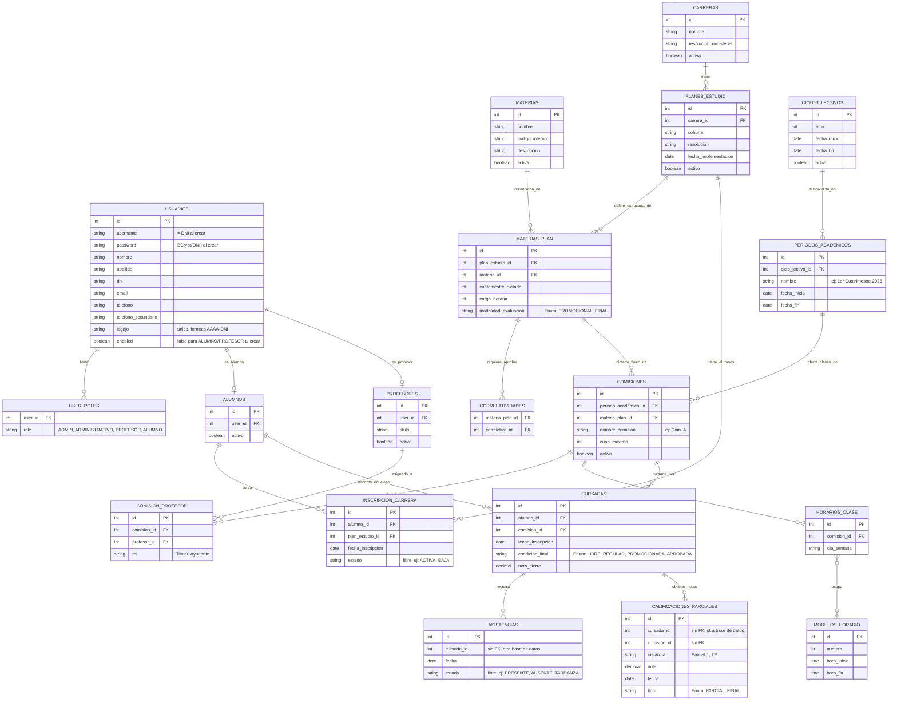

# Modelo de Datos (Diagrama Entidad-Relación)

Este modelo reemplaza la estructura de entidades planas anterior por un diseño jerárquico alineado con los principios de Arquitectura Funcional definidos para el ERP.

## Cambios Arquitectónicos Críticos respecto al modelo anterior:
1. **Desacople de Materias:** `MATERIAS` es ahora un catálogo maestro. La relación con la carrera se da mediante `MATERIAS_PLAN`. Esto evita crear 5 veces "Inglés" si está en 5 carreras.
2. **Contexto Operativo:** Desaparece `CUATRIMESTRES` como tabla aislada y nacen `CICLOS_LECTIVOS` y `PERIODOS_ACADEMICOS`.
3. **Comisiones Contextualizadas:** `COMISIONES` ya no cuelga de una materia suelta, sino de una `MATERIAS_PLAN` dentro de un `PERIODO_ACADEMICO`.
4. **Identidad Unificada (agregado 2026-07-08):** `ALUMNOS`/`PROFESORES` no guardan `dni`/`nombre`/`apellido` propios — son "roles" que apuntan 1:1 a `USUARIOS`, la entidad central de identidad (login, JWT, `legajo` único formato `AAAA-DNI`). Una misma persona puede tener ambos roles sobre el mismo `USUARIOS.id`.

> Corregido 2026-07-12 contra el modelo Java real (se incluye `modalidad_evaluacion` en `MATERIAS_PLAN`, `tipo` y `comision_id` en `CALIFICACIONES_PARCIALES`, y `condicion_final` como Enum en `CURSADAS`. Histórico: unificación de actores `USUARIOS` el 2026-07-08).

---

