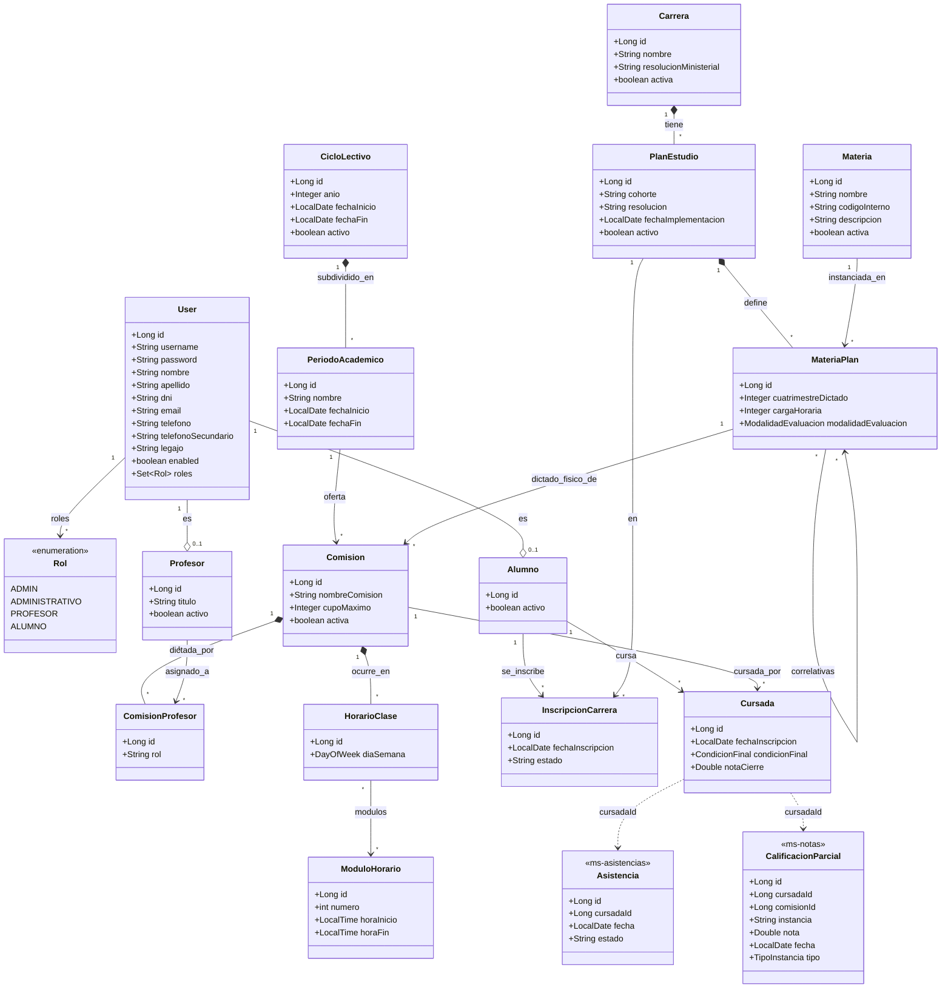

# Diagrama de Clases (Conceptual)

> Actualizado 2026-07-12 contra las entidades JPA reales (`backend/core/.../model/`, `backend/security/.../model/User.java`). Se reflejan los cambios del refactor de Bounded Contexts y las actualizaciones recientes (enums de modalidad de evaluación, tipos de instancia, condiciones de cursada, etc.).

### Notas

- `Cursada.condicionFinal` utiliza el enum `CondicionFinal` (`LIBRE`, `REGULAR`, `PROMOCIONADA`, `APROBADA`), habiendo reemplazado a campos de texto libre anteriores.
- `Asistencia` y `CalificacionParcial` viven en bases de datos separadas (`db_asistencias`, `db_calificaciones` en microservicios independientes) — la relación con `Cursada` y `Comision` es solo referencial por ID (`cursadaId`, `comisionId`), no por una FK real de base de datos relacional.
