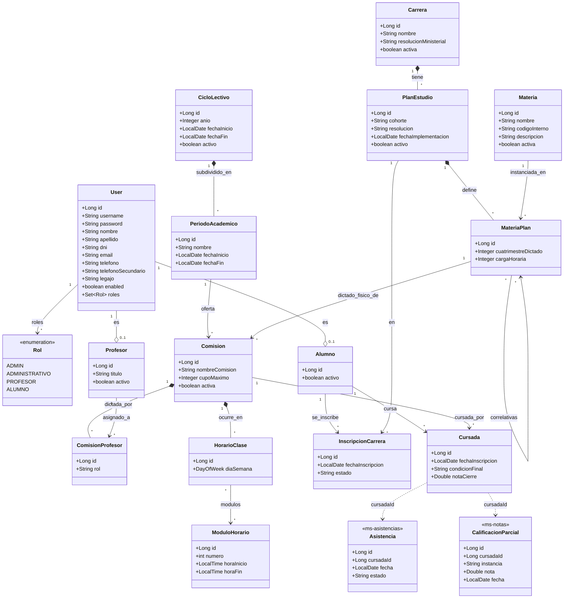

# Diagrama de Clases (Conceptual)

> Reescrito 2026-07-08. La versión anterior (2026-06-13) modelaba el proyecto base: `ComisionMateria`, `Cuatrimestre`, `AlumnoCarrera`, `AlumnoInscripto`, `EstadoCursada` (como entidad), `Examen`, `Nota`, `TipoEvaluacion` — ninguna de estas clases existe hoy. Reescrito contra las entidades JPA reales (`backend/core/.../model/`, `backend/security/.../model/User.java`).

### Notas

- `EstadoCursada` (enum `REGULAR`/`APROBADO`/`RECURSA`) existe en el código (`model/EstadoCursada.java`) pero está **sin usar** — `Cursada.condicionFinal` es un `String` libre, no tipado contra ese enum. No se incluye en el diagrama por ese motivo.
- `HorarioClase`/`ModuloHorario` existen en el backend pero no tienen ningún frontend que los consuma (ver `.remember/PENDIENTES.md` ítem 9).
- `Asistencia` y `CalificacionParcial` viven en bases de datos separadas (`db_asistencias`, `db_calificaciones`) — la relación con `Cursada` es solo por convención de `cursadaId`, no una FK real de base de datos.
