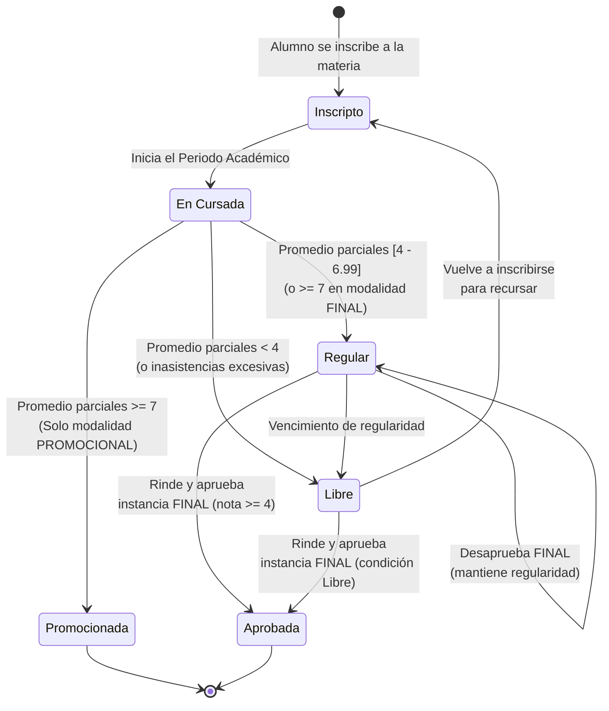

# Diagrama de Estados: Estado Académico del Alumno

Este diagrama modela las transiciones por las que pasa un alumno durante la cursada de una materia, desde su inscripción hasta la aprobación o recursada, cumpliendo con la exigencia del documento de requerimientos.

> **Estado real (2026-07-12):** este diagrama modela el diseño conceptual y la lógica implementada actual. A nivel de código, el sistema maneja el estado mediante el enum `CondicionFinal` (`LIBRE`, `REGULAR`, `PROMOCIONADA`, `APROBADA`).
> - Las transiciones por **notas** se calculan automáticamente (`CondicionCursadaService`): el promedio de parciales determina si es `REGULAR`, `LIBRE` o `PROMOCIONADA` (dependiendo de la modalidad de la materia). Una instancia `FINAL` aprobada avanza de `REGULAR` a `APROBADA`.
> - Las transiciones por **asistencia** (cálculo del 70%) aún no disparan cambios automáticos, manteniéndose como deuda técnica (ver `.remember/PENDIENTES.md`).

### Reglas de Negocio Representadas:
- Para alcanzar el estado **Regular** o **Promocionada**, el sistema evalúa el promedio de los parciales y la modalidad de evaluación de la materia (`PROMOCIONAL` o `FINAL`).
- Las inasistencias (pendiente de automatizar el umbral de < 70%) derivan en estado **Libre**.
- Un alumno **Regular** finaliza su ciclo y pasa a **Aprobada** al aprobar la instancia de evaluación `FINAL`. Si desaprueba el final (nota < 4), mantiene la regularidad hasta su vencimiento.
- Un alumno **Libre** puede rendir la instancia `FINAL` en condición de libre. Si la aprueba, pasa a **Aprobada**. (Pendiente de habilitar en el backend).
- Si un alumno queda **Libre** (y no aprueba un examen libre), puede volver al estado inicial de inscripción para recursar la materia.
