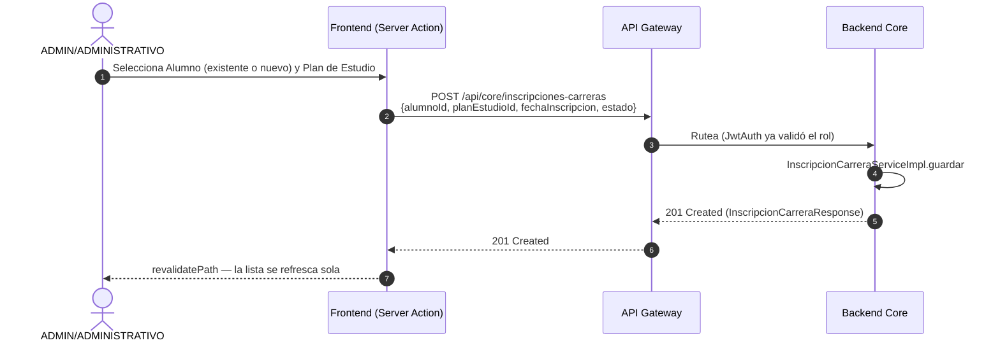
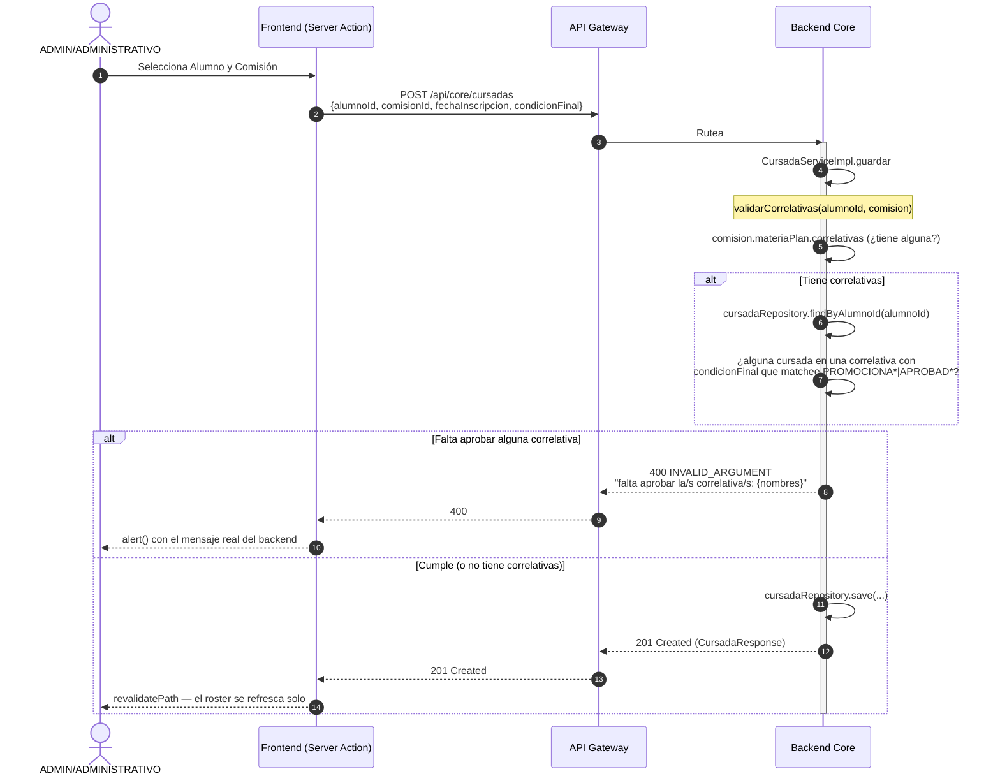

# Diagramas de Secuencia: Inscripciones

> Reescrito 2026-07-08 con endpoints y nombres de tabla reales (`/api/core/...`, `InscripcionCarrera`, `Cursada`, `MateriaPlan.correlativas`). El flujo 1 y la validación de correlativas del flujo 2 coinciden con lo implementado; el resto de las validaciones (pertenencia a la carrera, alumno ACTIVO) son conceptualmente correctas pero no se verificó línea por línea contra el código de `InscripcionCarreraServiceImpl`/`CursadaServiceImpl`.

A continuación se presentan los flujos de inscripción, tanto para una Carrera como para una Comisión (materia). Según las reglas de negocio, actualmente el sistema es operado por **ADMIN/ADMINISTRATIVO** (el alumno no autogestiona sus inscripciones en esta fase; **PROFESOR** tampoco — desde 2026-07-08 puede ver el roster de sus propias comisiones, pero no inscribir).

---

## 1. Inscripción de Alumno a una Carrera

Este proceso vincula al alumno con un `PlanEstudio` concreto de una `Carrera`.

---

## 2. Inscripción de Alumno a una Comisión (Cursada)

Una vez que el alumno pertenece a una carrera, se lo matricula a una `Comision` concreta (materia dictada en un período). Aquí el sistema valida las correlativas.

### Puntos clave de este flujo

- **El actor siempre es ADMIN/ADMINISTRATIVO** para ambos flujos (crear/editar/matricular). No hay autogestión de alumno ni de profesor.
- **Separación de inscripciones:** inscribirse a una Carrera (`InscripcionCarrera`) es independiente de matricularse en una Comisión concreta (`Cursada`) — son dos entidades y dos endpoints distintos.
- **Correlativas (implementado 2026-07-08):** la validación real vive en `CursadaServiceImpl.validarCorrelativas`, se dispara en cada `POST /api/core/cursadas` (incluida la matriculación masiva a un cuatrimestre completo, que hace un `POST` por comisión). **Falta:** detección de ciclos en `MateriaPlan.correlativas` — ver `docs/01.10-Analisis_Modelo.md` punto 1.
