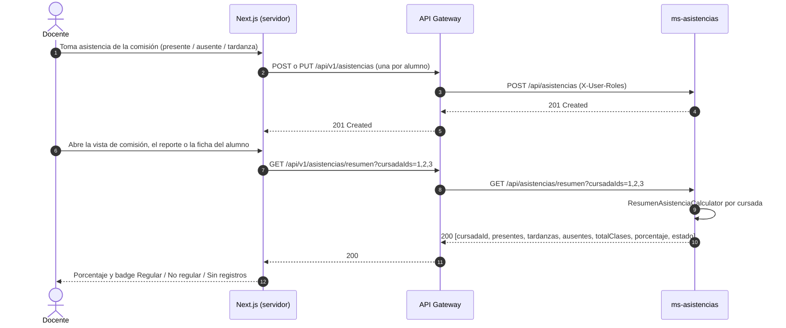
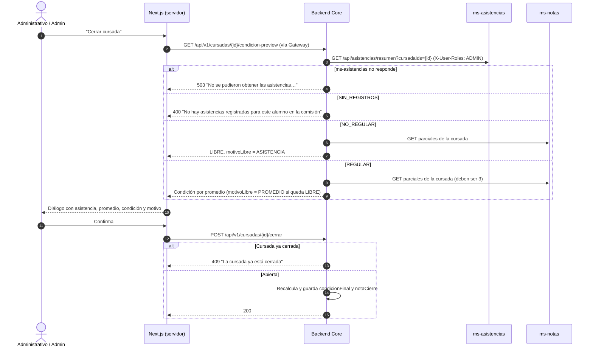

# Diagrama de Secuencia: Asistencia y Regularidad (70 %)

> Reescrito 2026-10-07 con lo implementado en [`specs/002-regularidad-asistencia`](../specs/002-regularidad-asistencia/spec.md) (US-ASIS-02, US-REP-01, anexo US-ASIS-03/05). Reemplaza el diseño anterior, en el que `ms-asistencias` notificaba "Libre" al Core en cada carga: nunca se implementó.

## Reglas
- **Porcentaje** = clases en que el alumno estuvo presente ÷ sus clases con marca × 100. La **tardanza cuenta como presente**. Las fechas en que el alumno no tiene marca (por ejemplo, se inscribió después) no cuentan en su total.
- **REGULAR** con 70 % o más; **NO_REGULAR** por debajo; **SIN_REGISTROS** si no tiene ninguna clase con marca. Se compara sin redondear (70 % exacto es regular).
- El cálculo vive en `ms-asistencias` (`ResumenAsistenciaCalculator`), el dueño de los datos; el resto del sistema consume el resumen.
- La asistencia afecta la condición **solo al cerrar la cursada**: NO_REGULAR deja LIBRE cualquiera sea el promedio; REGULAR sigue la regla de parciales. Una cursada cerrada no se recalcula.

## 1. Registro y consulta del porcentaje

## 2. Cierre de cursada con regularidad

## Consideraciones
- **Comunicación interservicio:** el Core consulta a `ms-asistencias` por HTTP (C1.4, C4.1); no lee su base. Suma acoplamiento sincrónico: ver deuda #22 en [`pendientes.md`](./pendientes.md).
- **Permisos:** el endpoint de resumen exige ADMIN, ADMINISTRATIVO o PROFESOR. Que un profesor vea solo sus comisiones se controla en los Server Components de Next (deuda #42).
- **Fuera de alcance:** inasistencias justificadas (US-ASIS-04) y bloquear la edición de asistencias después del cierre (parte de US-ASIS-05).
