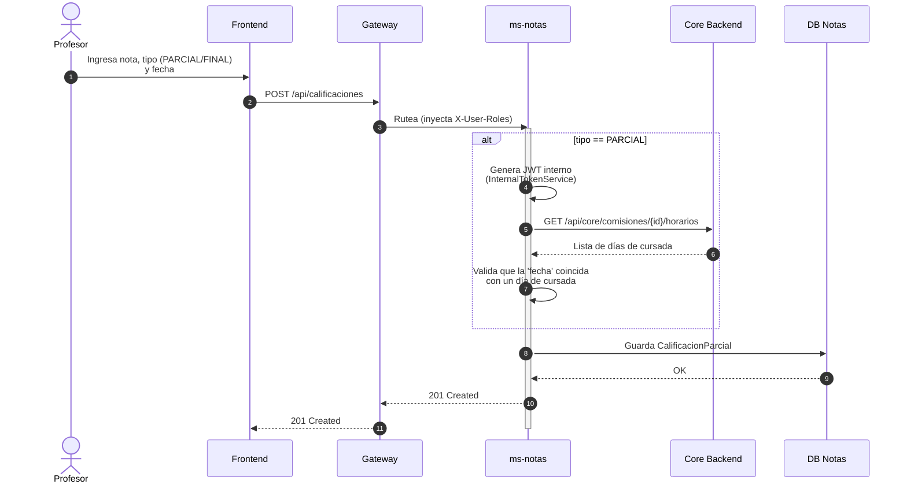
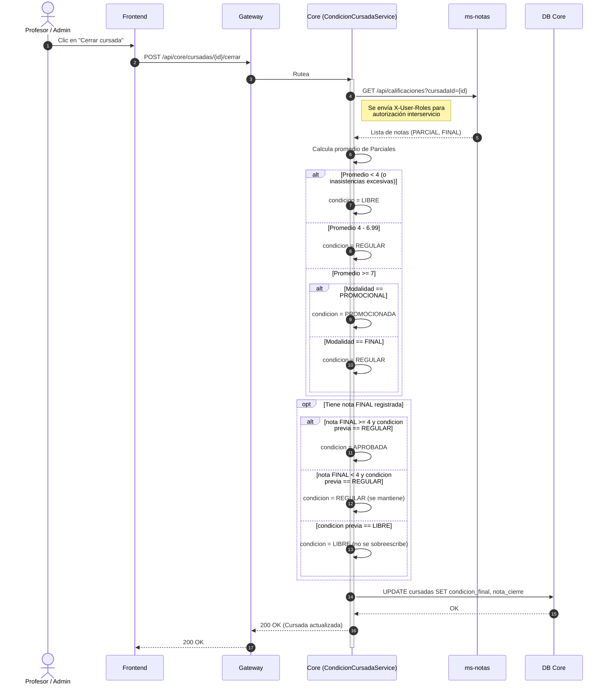

# Diagrama de Secuencia: Registro de Calificaciones y Cierre de Cursada

Este diagrama ilustra el flujo implementado (2026-07-12) para el registro de calificaciones (microservicio `ms-notas`) y el cálculo automático de la condición final del alumno (Core), cumpliendo con la validación de fechas de cursada y comunicación interservicios.

## 1. Registro de Calificación Parcial o Final

El profesor registra una nota en `ms-notas`. Para asegurar consistencia, el microservicio valida internamente contra el Core que la fecha coincida con un día de cursada real (excepto en exámenes finales).

## 2. Cierre de Cursada (Cálculo Automático)

El profesor o administrador solicita cerrar la cursada. El Core asume la responsabilidad de contactar a `ms-notas` para recolectar el historial y calcular la situación definitiva del alumno según la modalidad de la materia.

### Reglas de Diseño Implementadas
- **Seguridad Interservicio Mixta**: El Core consulta a `ms-notas` pasándole de forma confiable el rol del usuario original (`X-User-Roles`). Sin embargo, cuando `ms-notas` necesita consultar al Core (para validar horarios), se utiliza un mecanismo de **JWT Interno** (con `JWT_SECRET` compartido).
- **Separación de Responsabilidades**: `ms-notas` es responsable exclusivo del almacenamiento CRUD de las notas. `Core` es el dueño de la lógica de negocio académica (promedios, modalidad, transiciones de estado) y orquesta el cierre de la cursada.
