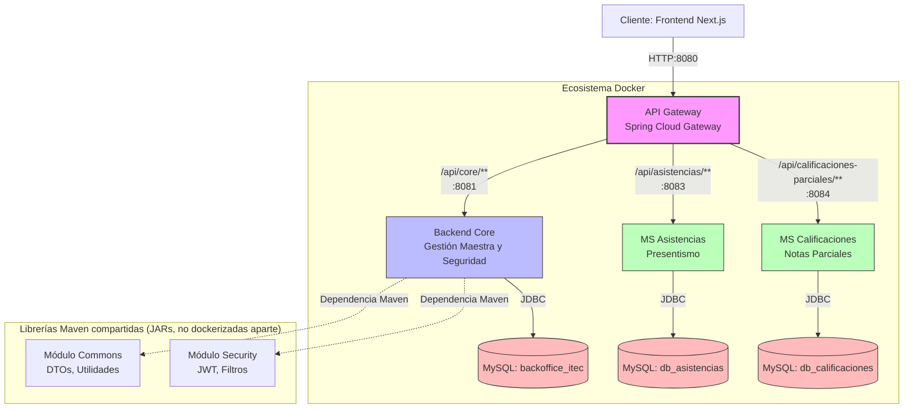
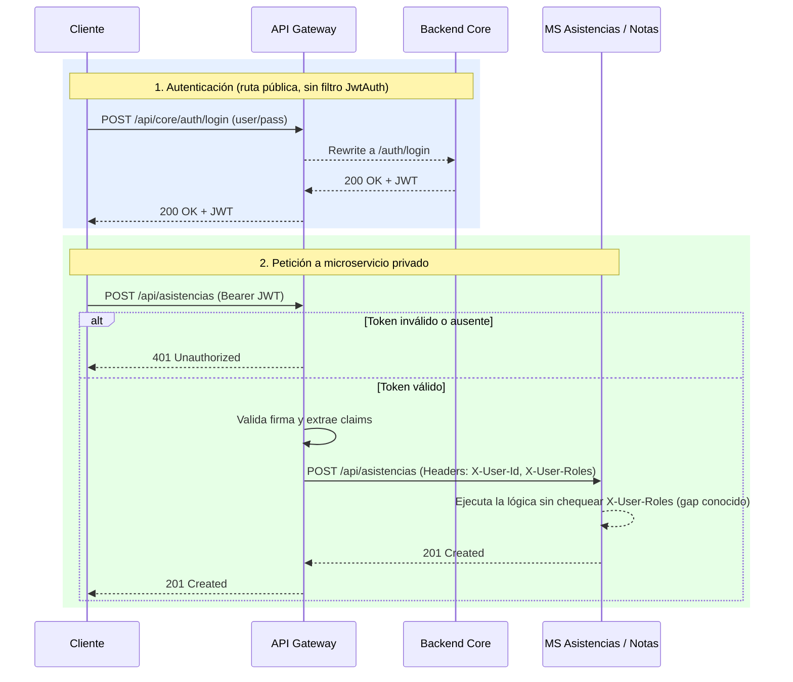

# Diagrama de Arquitectura

> Reescrito 2026-07-08. Reemplaza la versión anterior (2026-06-13), genérica y sin API Gateway. Consolida `docs/arquitectura/diagrama_ecosistema.md`, corrigiendo dos errores contra el `application.yml` real del Gateway: la ruta de `ms-notas` es `/api/calificaciones-parciales/**` (no `/api/notas/*`), y el flujo de JWT offloading (sección 2) describe el diseño, pero **`ms-notas`/`ms-asistencias` no leen `X-User-Roles`** — ver `.remember/PENDIENTES.md` ítem 7.

El proyecto está construido bajo una arquitectura de microservicios: cada dominio transaccional está aislado y orquestado a través de un API Gateway (Spring Cloud Gateway).

## 1. Diagrama de Servicios

**Nota sobre aislamiento:** `ms-asistencias` y `ms-calificaciones` no dependen del módulo `security` (no tienen Spring Security propio) — confían en que el Gateway ya validó el JWT antes de proxear la request (ver sección 2). No importan JARs `commons`/`security` como sí hace `Core`.

## 2. Flujo de Seguridad (JWT en el Gateway)

El Gateway es el único punto de entrada expuesto. El filtro `JwtAuth` (aplicado a las rutas `core-api`, `asistencias-api`, `notas-api`) valida el JWT con la misma clave simétrica del Core; si falta o es inválido, responde `401` **antes** de llegar al microservicio (confirmado con `curl` sin token → 401 en ambos). Si es válido, inyecta los claims como headers (`X-User-Id`, `X-User-Roles`, `X-User-Email`).

**Estado real:** el Core sí usa esos headers/su propio JWT vía Spring Security (`@PreAuthorize` por rol en cada controller). `ms-notas` y `ms-asistencias` **no leen `X-User-Roles`** — cualquier usuario autenticado, de cualquier rol, puede operar sobre esos dos endpoints; solo se exige que el token exista y sea válido, no que el rol sea el correcto. Harden pendiente, ver `.remember/PENDIENTES.md` ítem 7.

## 3. Diccionario de Servicios

- **Backend Core:** dueño de los datos estructurales (Alumnos, Profesores, Carreras, Planes, Materias, Comisiones, Cursadas, Inscripciones, Usuarios). Expone login y emisión de JWT. Único servicio con `@PreAuthorize` por rol.
- **MS Asistencias:** conoce solo `cursadaId + fecha + estado` para registrar presentismo.
- **MS Calificaciones (ms-notas):** conoce solo `cursadaId + instancia + nota + fecha` para registrar calificaciones parciales.
- **API Gateway:** enrutador de tráfico y validador de JWT (autenticación). Puerto `8080`. No hace autorización por rol para las rutas de `ms-asistencias`/`ms-notas` — solo `core-api`.
