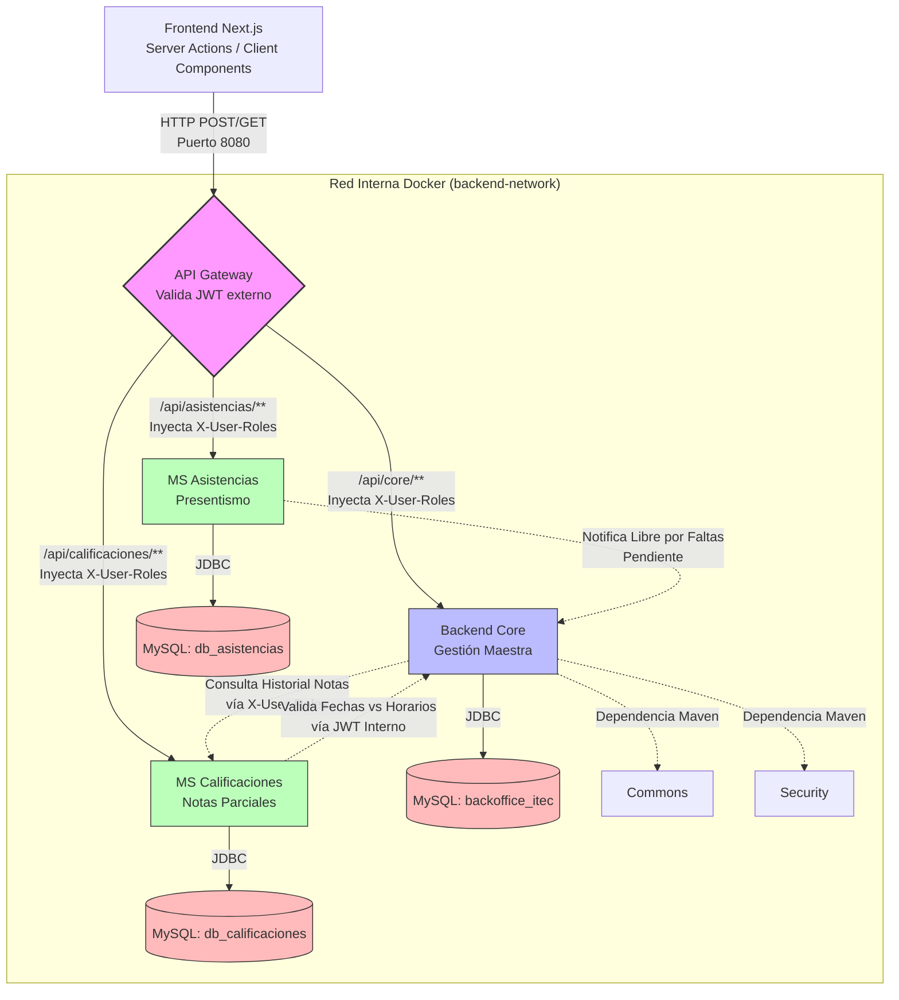
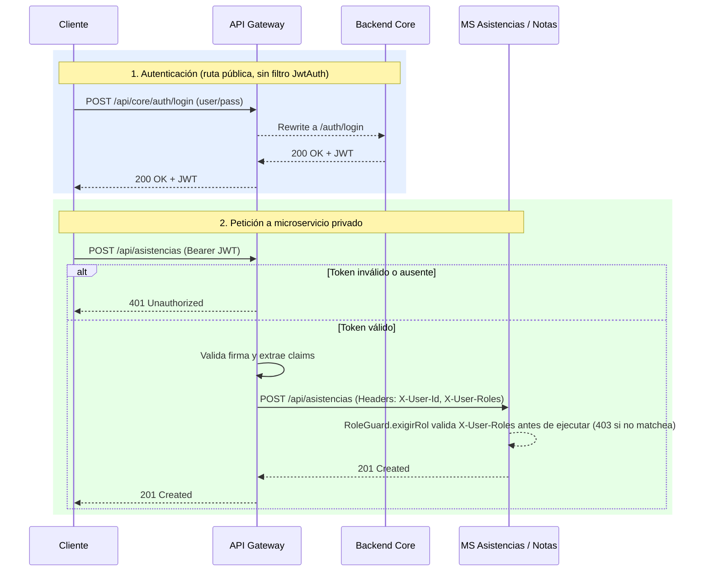

# Diagrama de Arquitectura

> Reescrito 2026-07-12. Consolida la arquitectura real (Gateway, Core, ms-notas, ms-asistencias) incluyendo los recientes cruces interservicios con JWT interno y validaciones por rol en los microservicios.

El proyecto está construido bajo una arquitectura de microservicios: cada dominio transaccional está aislado y orquestado a través de un API Gateway (Spring Cloud Gateway).

## 1. Diagrama de Servicios

**Nota sobre aislamiento:** `ms-asistencias` y `ms-calificaciones` no dependen del módulo `security` (no tienen Spring Security propio) — confían en que el Gateway ya validó el JWT antes de proxear la request (ver sección 2). No importan JARs `commons`/`security` como sí hace `Core`.

## 2. Flujo de Seguridad (JWT en el Gateway)

El Gateway es el único punto de entrada expuesto. El filtro `JwtAuth` (aplicado a las rutas `core-api`, `asistencias-api`, `notas-api`) valida el JWT con la misma clave simétrica del Core; si falta o es inválido, responde `401` **antes** de llegar al microservicio (confirmado con `curl` sin token → 401 en ambos). Si es válido, inyecta los claims como headers (`X-User-Id`, `X-User-Roles`, `X-User-Email`).

**Estado real:** el Core usa su propio JWT vía Spring Security (`@PreAuthorize` por rol). `ms-notas` y `ms-asistencias` leen `X-User-Roles` manualmente vía `RoleGuard.exigirRol` (ADMIN/ADMINISTRATIVO/PROFESOR pueden crear/modificar, solo ADMIN/ADMINISTRATIVO elimina). Además, cuando estos MS necesitan consultar al Core (ej. para validar que la fecha de la nota coincide con el horario de clase), utilizan un **JWT Interno** generado por `InternalTokenService` con una firma compartida.

## 3. Diccionario de Servicios

- **Backend Core:** dueño de los datos estructurales y académicos, orquestando el cierre de cursada (calcula la condición final). Expone login y emisión de JWT.
- **MS Asistencias:** conoce `cursadaId + fecha + estado` para registrar presentismo.
- **MS Calificaciones (ms-notas):** conoce `cursadaId + instancia + tipo (PARCIAL/FINAL) + nota + fecha`. Consulta al Core para validar cronogramas.
- **API Gateway:** enrutador de tráfico y validador de JWT externo.
