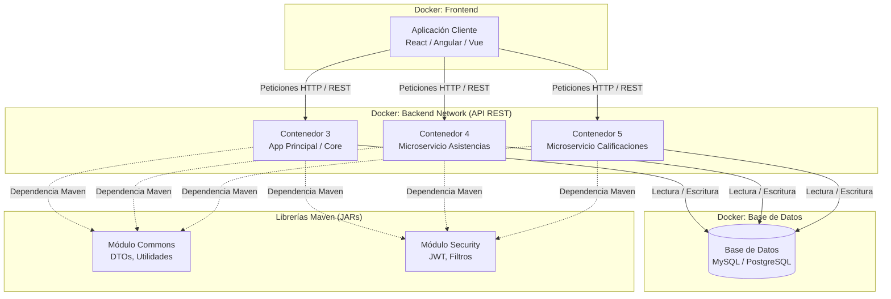

# Diagrama de Arquitectura

El siguiente diagrama representa la arquitectura general del sistema, tanto a nivel de componentes (módulos Maven) como a nivel de despliegue (contenedores Docker), basándonos en los requerimientos definidos.

### Notas sobre la Arquitectura:
- **Orquestación:** Todos los contenedores se comunican a través de una misma red definida en el `docker-compose.yml`.
- **Desacoplamiento:** Las asistencias y calificaciones funcionan como microservicios separados de la App Principal para mayor escalabilidad.
- **Seguridad y Comunes:** Se emplean módulos compartidos (`commons` y `security`) que se inyectan en tiempo de compilación a los 3 contenedores backend.
