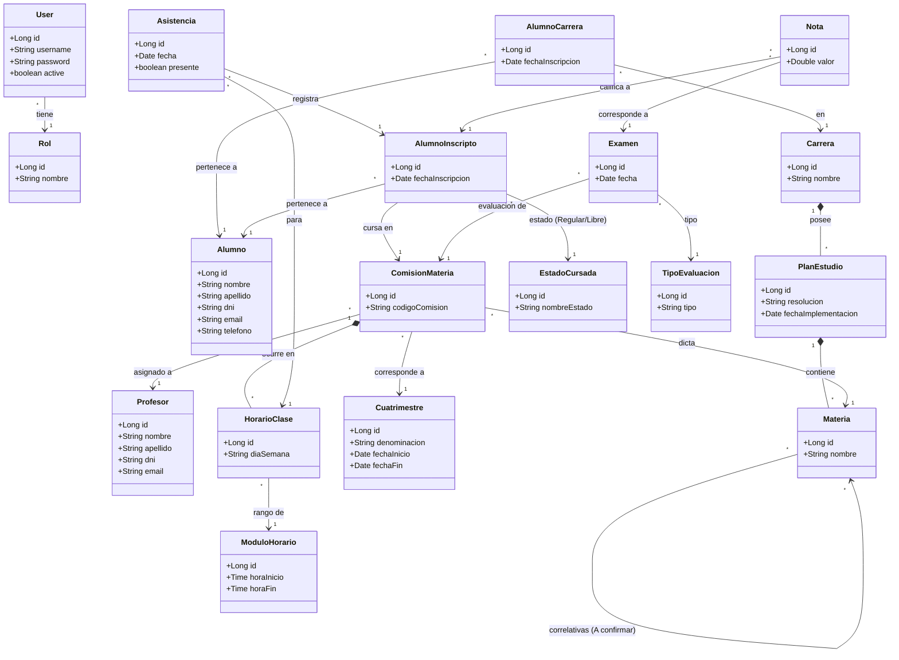

# Diagrama de Clases (Conceptual)

A continuación se presenta el diagrama de clases modelado a partir de las entidades actuales del backend. Este diagrama refleja la estructura de la gestión académica del ITEC N°1.

