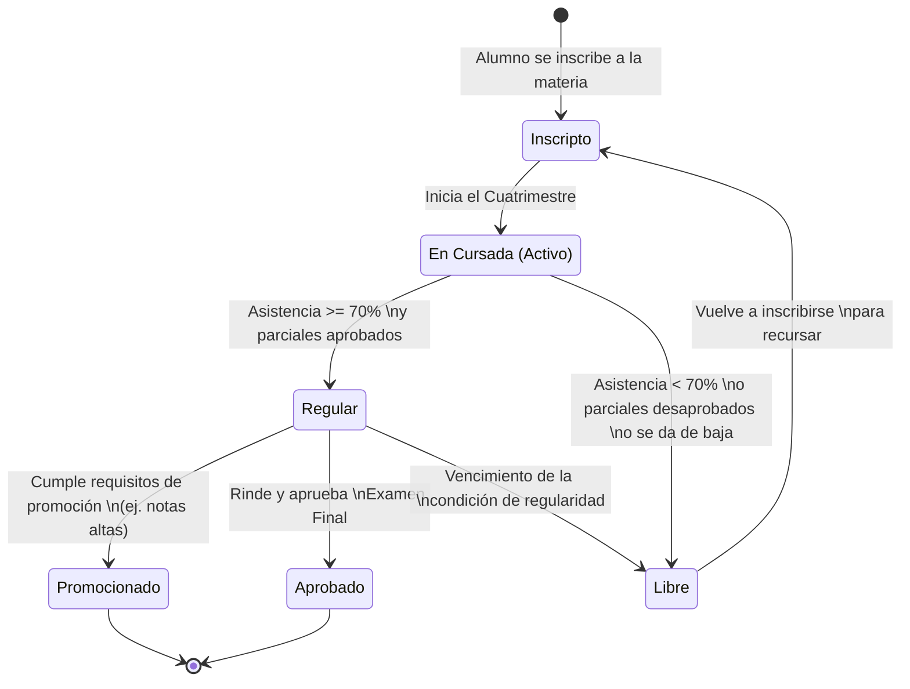

# Diagrama de Estados: Estado Académico del Alumno

Este diagrama modela las transiciones por las que pasa un alumno durante la cursada de una materia, desde su inscripción hasta la aprobación o recursada, cumpliendo con la exigencia del documento de requerimientos.

### Reglas de Negocio Representadas:
- Para alcanzar el estado **Regular**, el sistema debe calcular que las asistencias representen al menos el 70% del total de clases de esa comisión.
- Si un alumno queda **Libre** (ya sea por faltas o por desaprobar exámenes/vencimiento), debe volver al estado inicial de inscripción para recursar.
- Un alumno **Regular** finaliza su ciclo al aprobar el examen final o si el sistema contempla el estado de promoción directa.
