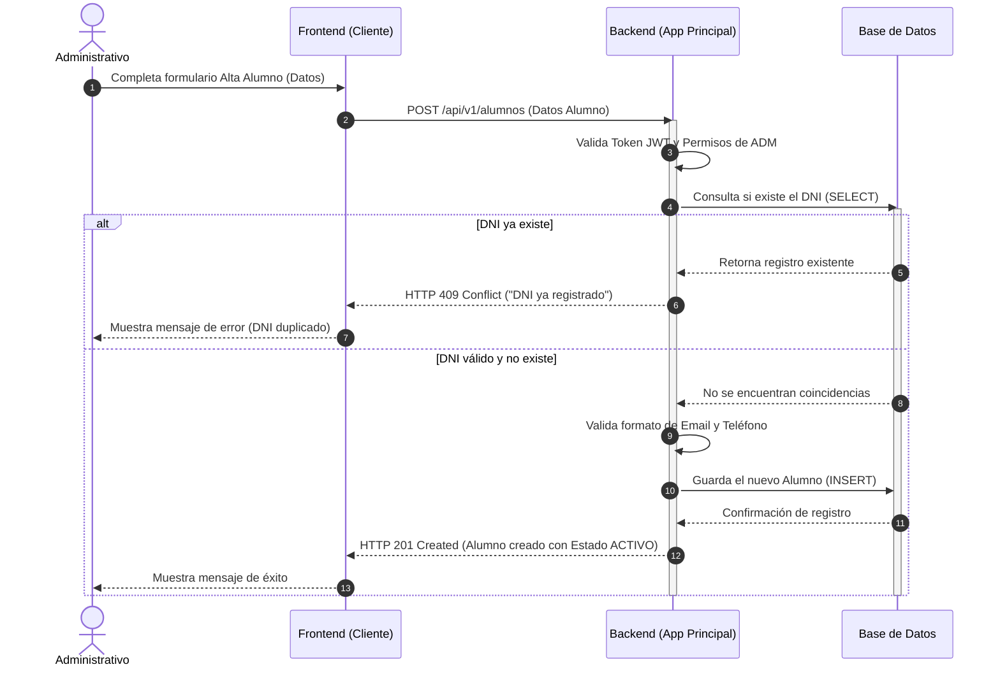

# Diagrama de Secuencia: Alta de Alumno

Este diagrama ilustra el flujo de comunicación entre los componentes del sistema para el caso de uso de "Crear Alumno" (US-ALU-01), abarcando desde la interacción del usuario en el frontend hasta la validación y guardado en la base de datos por parte del backend.

