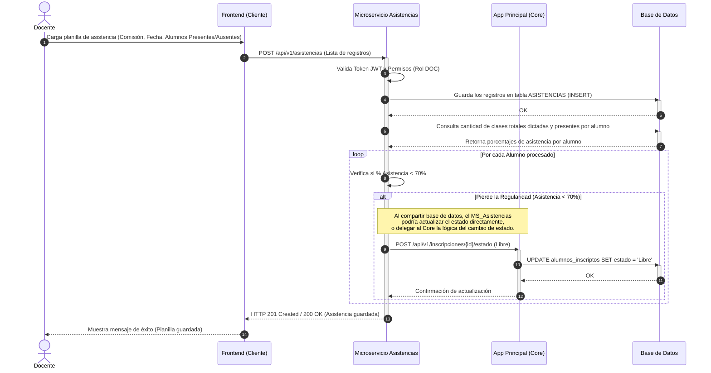

# Diagrama de Secuencia: Registro de Asistencias

Este diagrama ilustra el flujo específico para el registro de asistencias por parte de un docente. Contempla la interacción con el **Microservicio de Asistencias** y la lógica de negocio para el cálculo del 70% de presentismo (que puede derivar en la pérdida de la regularidad del alumno).

### 💡 Consideraciones y Reglas de Negocio a tener en cuenta:

1. **Responsabilidad del Microservicio:** Según la arquitectura, el microservicio de Asistencias recibe el flujo pesado del alta de asistencias.
2. **Cálculo de Totales:** Para poder calcular si un alumno quedó por debajo del 70%, el sistema primero debe poder saber la *cantidad total de clases que han transcurrido* para esa comisión hasta la fecha, y contrastarlo con las presencias del alumno.
3. **Comunicación Interservicio vs Base de Datos Compartida:** 
   - Como la arquitectura define un monolito de base de datos compartida ("Contenedor Base de Datos"), el MS_Asistencias podría teóricamente hacer el `UPDATE` directo del estado. 
   - Sin embargo, **por buenas prácticas de diseño**, se suele representar (como se hizo aquí) que el encargado de modificar la inscripción (estado académico) es la *App Principal (Core)*. Por ello, el microservicio se comunica con el Core para notificar la baja a "Libre".
4. **Fechas Hábiles / Feriados:** El sistema debería contemplar o que el docente registre las clases una por una en los días que correspondan, para no contar días sin clases dentro del total para el cálculo del porcentaje.
