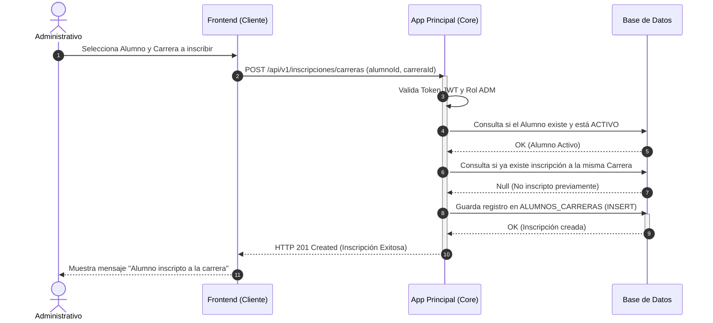
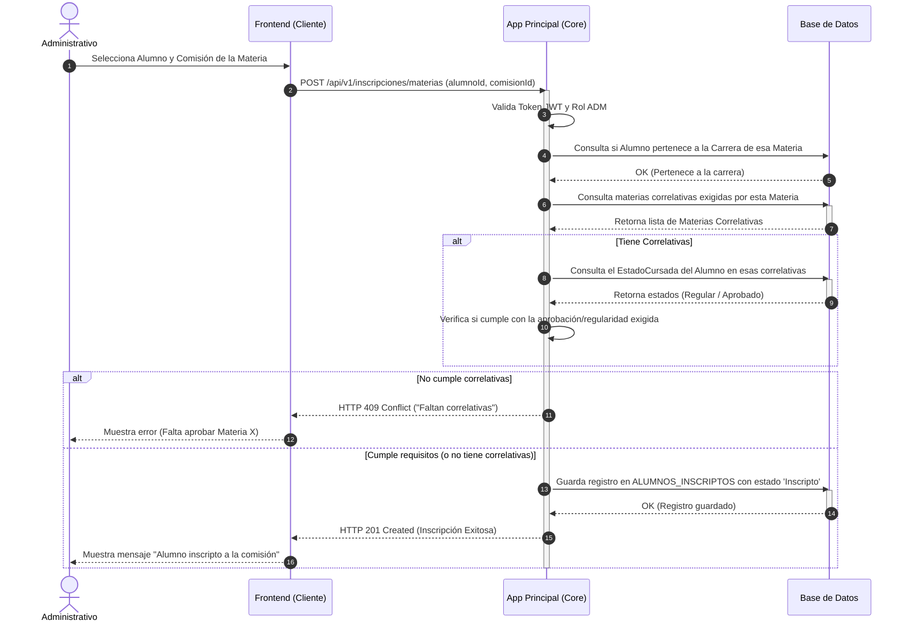

# Diagramas de Secuencia: Inscripciones

A continuación se presentan los flujos de inscripción, tanto para una Carrera como para una Materia. Según las reglas de negocio, actualmente el sistema es operado por el **Administrativo** (el alumno no autogestiona sus inscripciones en esta fase).

---

## 1. Inscripción de Alumno a una Carrera

Este proceso vincula al alumno con el plan de estudios general. 

---

## 2. Inscripción de Alumno a una Materia (Comisión)

Una vez que el alumno pertenece a una carrera, el Administrativo lo inscribe a las materias (específicamente a una comisión) en el cuatrimestre correspondiente. Aquí es donde **el sistema debe validar las correlativas**.

### 💡 Puntos Claves de este Flujo:
* **El Actor siempre es el Administrativo**: Se asegura que solo un rol con permisos pueda alterar el plan y las cursadas de un estudiante.
* **Separación de Inscripciones**: Inscribirse a una carrera es independiente de inscribirse a cursar una materia. Primero debe existir la inscripción a la carrera (tabla `alumnos_carreras`).
* **Regla de Correlativas (Paso 9 y 10 del segundo diagrama)**: Es el punto más crítico. Antes de hacer el `INSERT` en `alumnos_inscriptos`, el backend debe buscar en el historial del alumno si las materias pre-requisito fueron cursadas y si su estado académico es válido (usualmente se exige estar "Aprobado" o "Regular" dependiendo el plan de estudios).
