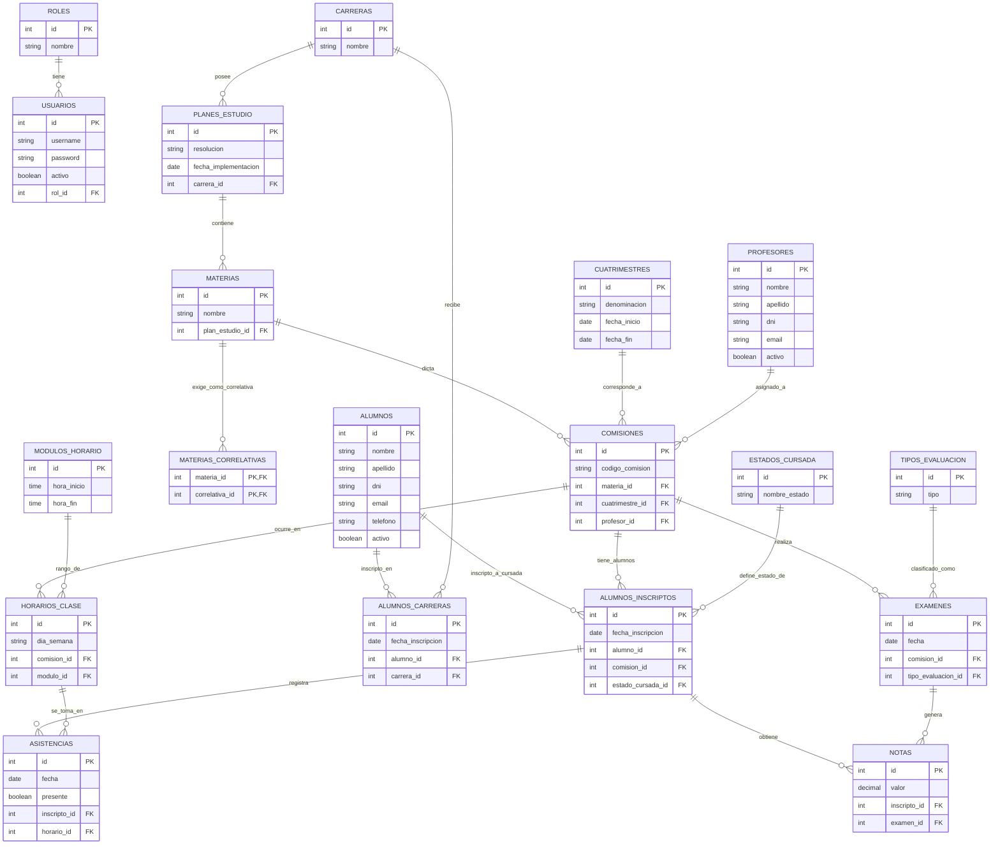

# Modelo de Datos (Diagrama Entidad-Relación)

A continuación se presenta el Modelo de Datos relacional estimado para el backend, estructurado en base a las entidades, sus atributos clave y las claves foráneas (FK) necesarias para relacionarlas de acuerdo con los requerimientos del ITEC N°1.

