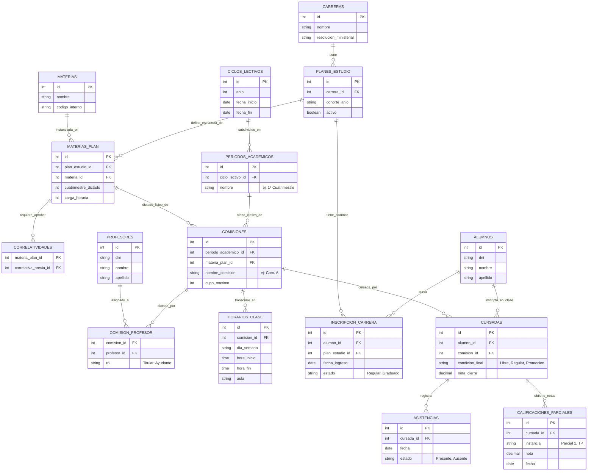

# Modelo de Datos (Diagrama Entidad-Relación)

Este modelo reemplaza la estructura de entidades planas anterior por un diseño jerárquico alineado con los principios de Arquitectura Funcional definidos para el ERP.

## Cambios Arquitectónicos Críticos respecto al modelo anterior:
1. **Desacople de Materias:** `MATERIAS` es ahora un catálogo maestro. La relación con la carrera se da mediante `MATERIAS_PLAN`. Esto evita crear 5 veces "Inglés" si está en 5 carreras.
2. **Contexto Operativo:** Desaparece `CUATRIMESTRES` como tabla aislada y nacen `CICLOS_LECTIVOS` y `PERIODOS_ACADEMICOS`.
3. **Comisiones Contextualizadas:** `COMISIONES` ya no cuelga de una materia suelta, sino de una `MATERIAS_PLAN` dentro de un `PERIODO_ACADEMICO`.

---

```mermaid
erDiagram
    %% 1. CATÁLOGO ACADÉMICO (Estructura)
    MATERIAS {
        int id PK
        string nombre
        string codigo_interno
    }
    
    CARRERAS {
        int id PK
        string nombre
        string resolucion_ministerial
    }
    
    PLANES_ESTUDIO {
        int id PK
        int carrera_id FK
        string cohorte_anio
        boolean activo
    }
    CARRERAS ||--o{ PLANES_ESTUDIO : tiene
    
    MATERIAS_PLAN {
        int id PK
        int plan_estudio_id FK
        int materia_id FK
        int cuatrimestre_dictado
        int carga_horaria
    }
    PLANES_ESTUDIO ||--o{ MATERIAS_PLAN : define_estructura_de
    MATERIAS ||--o{ MATERIAS_PLAN : instanciada_en
    
    CORRELATIVIDADES {
        int materia_plan_id FK
        int correlativa_previa_id FK
    }
    MATERIAS_PLAN ||--o{ CORRELATIVIDADES : requiere_aprobar

    %% 2. GESTIÓN ACADÉMICA (Operación Temporal)
    CICLOS_LECTIVOS {
        int id PK
        int anio
        date fecha_inicio
        date fecha_fin
    }
    
    PERIODOS_ACADEMICOS {
        int id PK
        int ciclo_lectivo_id FK
        string nombre "ej: 1º Cuatrimestre"
    }
    CICLOS_LECTIVOS ||--o{ PERIODOS_ACADEMICOS : subdividido_en

    COMISIONES {
        int id PK
        int periodo_academico_id FK
        int materia_plan_id FK
        string nombre_comision "ej: Com. A"
        int cupo_maximo
    }
    PERIODOS_ACADEMICOS ||--o{ COMISIONES : oferta_clases_de
    MATERIAS_PLAN ||--o{ COMISIONES : dictado_fisico_de

    COMISION_PROFESOR {
        int comision_id FK
        int profesor_id FK
        string rol "Titular, Ayudante"
    }
    COMISIONES ||--o{ COMISION_PROFESOR : dictada_por

    HORARIOS_CLASE {
        int id PK
        int comision_id FK
        string dia_semana
        time hora_inicio
        time hora_fin
        string aula
    }
    COMISIONES ||--o{ HORARIOS_CLASE : transcurre_en

    %% 3. ACTORES (Personas)
    ALUMNOS {
        int id PK
        string dni
        string nombre
        string apellido
    }
    
    PROFESORES {
        int id PK
        string dni
        string nombre
        string apellido
    }
    PROFESORES ||--o{ COMISION_PROFESOR : asignado_a

    %% 4. EL PUENTE (Registros / Trazabilidad)
    INSCRIPCION_CARRERA {
        int id PK
        int alumno_id FK
        int plan_estudio_id FK
        date fecha_ingreso
        string estado "Regular, Graduado"
    }
    ALUMNOS ||--o{ INSCRIPCION_CARRERA : cursa
    PLANES_ESTUDIO ||--o{ INSCRIPCION_CARRERA : tiene_alumnos

    CURSADAS {
        int id PK
        int alumno_id FK
        int comision_id FK
        string condicion_final "Libre, Regular, Promocion"
        decimal nota_cierre
    }
    ALUMNOS ||--o{ CURSADAS : inscripto_en_clase
    COMISIONES ||--o{ CURSADAS : cursada_por

    ASISTENCIAS {
        int id PK
        int cursada_id FK
        date fecha
        string estado "Presente, Ausente"
    }
    CURSADAS ||--o{ ASISTENCIAS : registra

    CALIFICACIONES_PARCIALES {
        int id PK
        int cursada_id FK
        string instancia "Parcial 1, TP"
        decimal nota
        date fecha
    }
    CURSADAS ||--o{ CALIFICACIONES_PARCIALES : obtiene_notas
```
