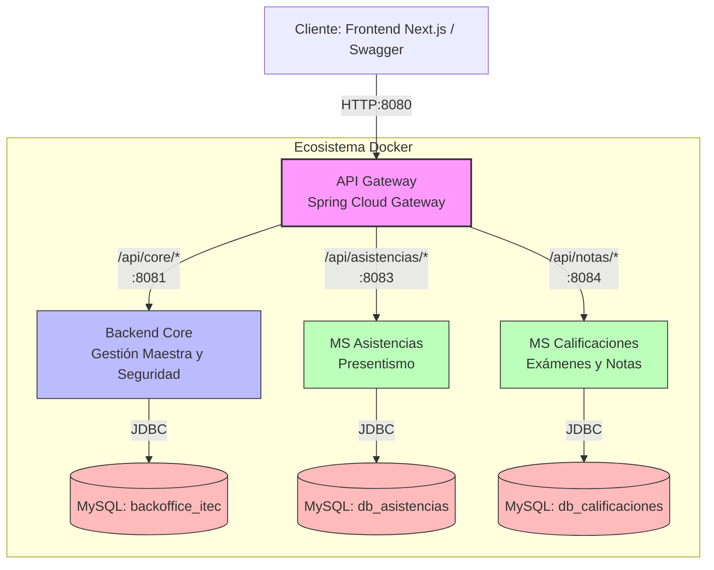
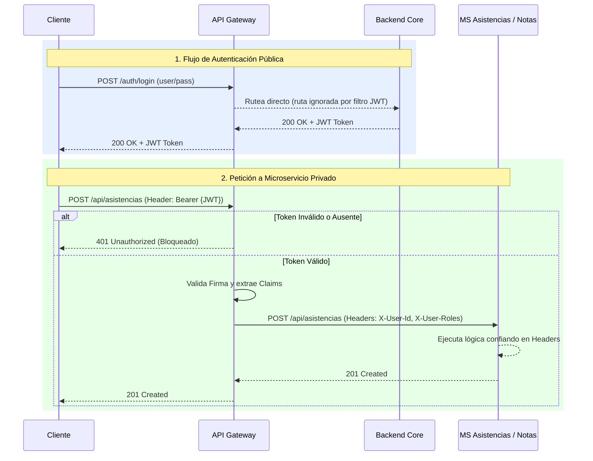

# Arquitectura del Sistema - Ecosistema de Microservicios

El proyecto ITEC Web 2026 está construido bajo una arquitectura moderna de microservicios, donde cada dominio transaccional está aislado y orquestado a través de un API Gateway.

## 1. Diagrama de Arquitectura de Servicios

El siguiente diagrama ilustra cómo fluyen las peticiones desde el cliente (Frontend/Postman) a través del Gateway hacia los diferentes microservicios, y cómo cada uno se conecta a su propia base de datos lógica para garantizar el aislamiento (evitando dependencias fuertes).

## 2. Flujo de Seguridad (JWT Offloading)

Para evitar replicar la lógica de Spring Security en cada microservicio, el sistema implementa un patrón de **API Gateway Token Offloading**. 

El Gateway es el único punto de entrada expuesto. Cuando recibe una petición hacia una ruta protegida, intercepta el token JWT, lo valida usando la misma llave simétrica (secret key) del Core, y si es válido, extrae la identidad del usuario y la inyecta como Headers HTTP (`X-User-Id`, `X-User-Roles`) para que los microservicios internos sepan quién está ejecutando la acción sin tener que revalidar el token.

## 3. Diccionario de Servicios

- **Backend Core:** Dueño de los datos estructurales del sistema (Alumnos, Profesores, Materias, Carreras, Inscripciones, Usuarios). Expone el inicio de sesión y la generación de JWT.
- **MS Asistencias:** Microservicio liviano. Solo conoce IDs del alumno y de la comisión (provistos por el core) para registrar el presentismo.
- **MS Calificaciones:** Microservicio liviano para gestionar evaluaciones, parciales y notas de un alumno en una comisión específica.
- **API Gateway:** Enrutador de tráfico y validador central de seguridad. Expuesto en el puerto `8080`.
