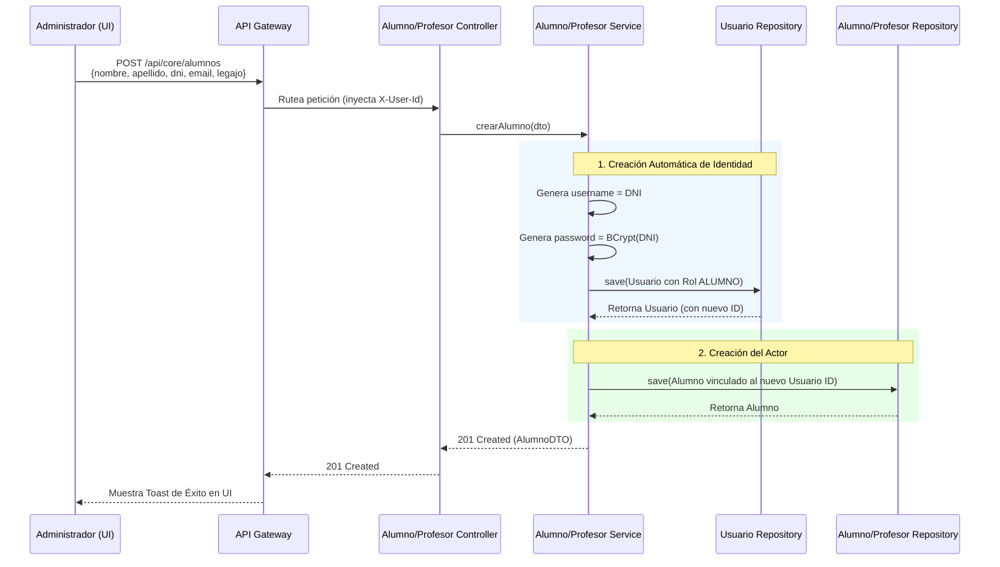

# Flujo de Creación de Actores (Alumnos / Profesores)

Este diagrama de secuencia ilustra la regla de negocio para la creación de actores en el sistema. Dado que el sistema actualmente es de uso exclusivo para personal administrativo, la creación de un `Alumno` o `Profesor` genera automáticamente un `Usuario` subyacente con credenciales derivadas de su DNI.

### Reglas Clave:
- El Frontend envía un solo formulario.
- La transacción es atómica a nivel de base de datos en el backend (`@Transactional` en el Service). Si falla la creación del Alumno, se hace rollback del Usuario.
